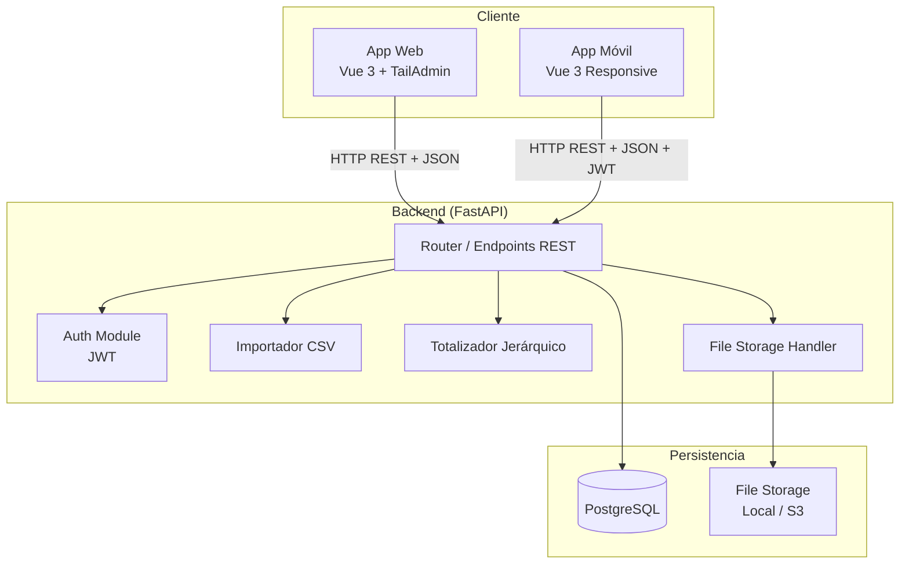
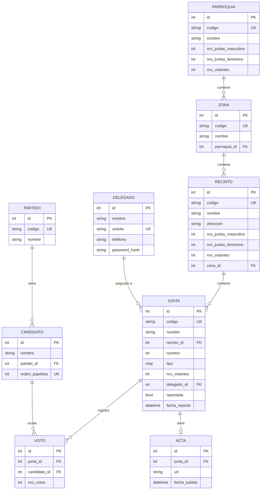

# Diseño Técnico: Sistema de Control Electoral

## Overview

El Sistema de Control Electoral es una plataforma distribuida en tres capas:

1. **Backend (FastAPI)**: API REST que centraliza toda la lógica de negocio, persistencia y autenticación.
2. **App Web (Vue 3 + TailAdmin)**: Interfaz de resultados para observadores electorales, con tablas, gráficas y filtros territoriales.
3. **App Móvil (Vue 3 responsive)**: Misma aplicación Vue adaptada para dispositivos móviles, usada por delegados para reportar votos.

El flujo principal es:
- El administrador importa la estructura territorial (parroquias → zonas → recintos → juntas) desde CSV.
- El administrador registra partidos, candidatos y delegados, y asigna delegados a juntas.
- El administrador ejecuta la operación "Encerar" para inicializar todos los registros de votos en cero.
- Los delegados inician sesión en la App Móvil, reportan votos por junta y suben la imagen del acta.
- Los observadores consultan resultados en tiempo real en la App Web con filtros territoriales.

---

## Architecture

### Diagrama de componentes



### Decisiones de arquitectura

| Decisión | Elección | Justificación |
|---|---|---|
| Base de datos | PostgreSQL | Soporte nativo de FK, integridad referencial, consultas de agregación eficientes |
| ORM | SQLAlchemy 2.x + Alembic | Estándar de facto en FastAPI; migraciones versionadas |
| Autenticación | JWT (python-jose) | Stateless, compatible con SPA y apps móviles |
| Almacenamiento de actas | Sistema de archivos local (configurable a S3) | Simplicidad inicial; abstracción permite migrar a S3 sin cambios en la API |
| Comunicación en tiempo real | Polling desde el frontend (intervalo configurable) | Simplicidad; evita complejidad de WebSockets para MVP |
| Validación | Pydantic v2 (integrado en FastAPI) | Validación automática de esquemas y generación de OpenAPI |

---

## Components and Interfaces

### Backend — Módulos principales

#### `routers/`
Cada entidad tiene su propio router FastAPI:

| Router | Prefijo | Responsabilidad |
|---|---|---|
| `parroquias.py` | `/parroquias` | CRUD de Parroquias |
| `zonas.py` | `/zonas` | CRUD de Zonas |
| `recintos.py` | `/recintos` | CRUD de Recintos |
| `juntas.py` | `/juntas` | CRUD de Juntas + asignación de delegados |
| `delegados.py` | `/delegados` | CRUD de Delegados |
| `partidos.py` | `/partidos` | CRUD de Partidos |
| `candidatos.py` | `/candidatos` | CRUD de Candidatos |
| `votos.py` | `/votos` | Reporte de votos, encerar |
| `importacion.py` | `/importar` | Importación CSV por entidad |
| `resultados.py` | `/resultados` | Agregación de votos y progreso |
| `auth.py` | `/auth` | Login de delegados, emisión JWT |
| `actas.py` | `/actas` | Subida y consulta de imágenes de actas |

#### `services/`
Lógica de negocio desacoplada de los routers:

- `totalizador.py`: Recalcula `nro_votantes`, `nro_juntas_masculino`, `nro_juntas_femenino` en cascada.
- `importador_csv.py`: Parsea CSV, aplica upsert, genera reporte de errores.
- `encerar.py`: Inicializa registros de Voto para todas las combinaciones Junta × Candidato.
- `resultados.py`: Agrega votos con filtros opcionales por parroquia/zona/recinto.

#### `models/`
Modelos SQLAlchemy que mapean las tablas de la base de datos.

#### `schemas/`
Esquemas Pydantic para request/response de cada entidad.

### Frontend — Estructura Vue 3

```
src/
  views/
    ResultadosView.vue       # Tabla + gráfica general con filtros
    LoginView.vue            # Login de delegados
    JuntasView.vue           # Lista de juntas del delegado
    ReporteVotosView.vue     # Formulario de reporte de votos
    ActaUploadView.vue       # Subida de imagen del acta
  components/
    GraficaBarras.vue        # Gráfica de barras (Chart.js)
    TablaResultados.vue      # Tabla de votos por candidato
    FiltroTerritorial.vue    # Selectores parroquia/zona/recinto
    FormularioVotos.vue      # Formulario de ingreso de votos
  stores/
    auth.ts                  # Estado de autenticación (Pinia)
    resultados.ts            # Estado de resultados y filtros
    juntas.ts                # Juntas del delegado activo
  api/
    client.ts                # Axios instance con interceptores JWT
    resultados.ts
    votos.ts
    auth.ts
```

### Interfaces REST principales

#### Autenticación
```
POST /auth/login
  Body: { cedula: string, password: string }
  Response 200: { access_token: string, token_type: "bearer" }
  Response 401: { detail: string }
```

#### Importación CSV
```
POST /importar/{entidad}   # entidad: parroquias | zonas | recintos | juntas
  Body: multipart/form-data  file: CSV
  Response 200: { insertados: int, actualizados: int, omitidos: int, errores: [{fila, campo}] }
```

#### Resultados
```
GET /resultados?parroquia_id=&zona_id=&recinto_id=
  Response 200: {
    candidatos: [{ id, nombre, partido, nro_votos, porcentaje }],
    total_votos: int
  }

GET /resultados/progreso?parroquia_id=&zona_id=&recinto_id=
  Response 200: {
    juntas_reportadas: int,
    juntas_total: int,
    porcentaje_juntas: float,
    votantes_ingresados: int,
    votantes_total: int,
    porcentaje_votantes: float
  }
```

#### Reporte de votos
```
PUT /votos/{junta_id}
  Headers: Authorization: Bearer <token>
  Body: { votos: [{ candidato_id: int, nro_votos: int }], nulos: int, blancos: int }
  Response 200: { junta_id, reportada: true, fecha_reporte: datetime }
```

#### Encerar
```
POST /votos/encerar
  Response 200: { registros_inicializados: int }
```

#### Subida de acta
```
POST /actas/{junta_id}
  Headers: Authorization: Bearer <token>
  Body: multipart/form-data  file: image/pdf
  Response 200: { url: string }
  Response 413: { detail: string }
```

---

## Data Models

### Diagrama entidad-relación



### Notas sobre el modelo

- `VOTO` tiene una restricción `UNIQUE(junta_id, candidato_id)` para garantizar un único registro por combinación.
- `JUNTA.tipo` acepta solo `'m'` o `'f'` (CHECK constraint).
- `CANDIDATO.orden_papeleta` es único a nivel global.
- `DELEGADO.password_hash` almacena la contraseña hasheada con bcrypt.
- `RECINTO.zona_id` es FK hacia `ZONA` (la jerarquía completa es Parroquia → Zona → Recinto → Junta).
- Los campos `nro_votantes`, `nro_juntas_masculino`, `nro_juntas_femenino` en Recinto, Zona y Parroquia son calculados y actualizados por el `totalizador.py` en cada operación de escritura sobre Juntas.


---

## Correctness Properties

*Una propiedad es una característica o comportamiento que debe mantenerse verdadero en todas las ejecuciones válidas del sistema — esencialmente, una declaración formal sobre lo que el sistema debe hacer. Las propiedades sirven como puente entre las especificaciones legibles por humanos y las garantías de corrección verificables por máquinas.*

### Property 1: Invariante de consistencia jerárquica de votantes

*Para cualquier* jerarquía territorial (Parroquia → Zona → Recinto → Junta), después de cualquier operación de creación o actualización de Juntas, el `nro_votantes` de cada nivel debe ser igual a la suma de `nro_votantes` de todos sus elementos hijos directos.

**Validates: Requirements 3.1, 3.2, 3.3, 3.6**

---

### Property 2: Invariante de conteo de juntas por tipo en Recinto

*Para cualquier* Recinto con un conjunto arbitrario de Juntas, `nro_juntas_masculino` debe ser igual al conteo de Juntas con `tipo = 'm'` y `nro_juntas_femenino` debe ser igual al conteo de Juntas con `tipo = 'f'` asociadas a ese Recinto.

**Validates: Requirements 3.4, 3.5**

---

### Property 3: Validación de FK inválida retorna 422

*Para cualquier* intento de crear o actualizar una entidad con una clave foránea que no corresponde a un registro existente (parroquia_id en Zona, recinto_id en Junta, partido_id en Candidato, delegado_id en Junta), el Backend debe retornar HTTP 422 con un mensaje descriptivo.

**Validates: Requirements 1.5, 1.6, 4.3, 5.5**

---

### Property 4: Round-trip del parser CSV

*Para cualquier* conjunto de registros válidos de cualquier entidad territorial (Parroquia, Zona, Recinto, Junta), serializar esos registros a formato CSV y luego parsear el CSV resultante debe producir registros equivalentes a los originales.

**Validates: Requirements 2.8**

---

### Property 5: Importación CSV persiste todas las filas válidas

*Para cualquier* archivo CSV con N filas válidas y M filas inválidas (campos obligatorios vacíos), la importación debe persistir exactamente N registros, omitir exactamente M filas, y el resumen retornado debe satisfacer: `insertados + actualizados + omitidos = N + M`.

**Validates: Requirements 2.1, 2.2, 2.3, 2.4, 2.5, 2.7**

---

### Property 6: Upsert por código en importación CSV

*Para cualquier* registro importado cuyo `codigo` ya existe en la base de datos, reimportarlo con valores diferentes debe actualizar el registro existente sin crear duplicados, de modo que `count(registros con ese codigo) = 1` después de la operación.

**Validates: Requirements 2.6**

---

### Property 7: Unicidad de orden_papeleta en Candidatos

*Para cualquier* intento de crear un Candidato con un `orden_papeleta` ya asignado a otro Candidato existente, el Backend debe retornar HTTP 422 indicando el conflicto.

**Validates: Requirements 4.4**

---

### Property 8: Asignación y desasignación de delegados a juntas

*Para cualquier* Delegado y cualquier conjunto de N Juntas, asignar el Delegado a todas esas Juntas debe resultar en que todas tengan `delegado_id = delegado.id`; y desasignar el Delegado de cualquiera de ellas debe resultar en `delegado_id = null` para esa Junta, sin afectar las demás.

**Validates: Requirements 5.2, 5.3, 5.4**

---

### Property 9: Cardinalidad de Encerar

*Para cualquier* estado de la base de datos con N Juntas y M Candidatos, después de ejecutar la operación Encerar, el número total de registros de Voto debe ser exactamente `N × M`, cada uno con `nro_votos = 0`, y el número retornado por la operación debe coincidir con `N × M`.

**Validates: Requirements 6.1, 6.2, 6.4**

---

### Property 10: Idempotencia de Encerar

*Para cualquier* estado de la base de datos, ejecutar la operación Encerar dos o más veces consecutivas debe producir el mismo resultado que ejecutarla una sola vez: todos los registros de Voto con `nro_votos = 0` y sin registros duplicados.

**Validates: Requirements 6.3**

---

### Property 11: Autenticación JWT — credenciales válidas e inválidas

*Para cualquier* Delegado con credenciales correctas, el endpoint de login debe retornar un JWT válido y decodificable que contenga el identificador del Delegado. *Para cualquier* combinación de credenciales incorrectas (cédula inexistente o contraseña incorrecta), el endpoint debe retornar HTTP 401.

**Validates: Requirements 7.1, 7.2**

---

### Property 12: Aislamiento de datos por delegado autenticado

*Para cualquier* Delegado autenticado con un JWT válido, el endpoint de juntas debe retornar únicamente las Juntas cuyo `delegado_id` coincide con el identificador del Delegado en el token, sin exponer juntas de otros delegados.

**Validates: Requirements 7.3**

---

### Property 13: Persistencia correcta de votos reportados

*Para cualquier* combinación de Junta y Candidato, y cualquier valor entero no negativo de votos, enviar ese valor al Backend debe resultar en que el registro de Voto correspondiente tenga `nro_votos` igual al valor enviado, y la Junta quede marcada como `reportada = true` con `fecha_reporte` establecida.

**Validates: Requirements 9.1, 9.6**

---

### Property 14: Validación de suma de votos vs. nro_votantes

*Para cualquier* conjunto de valores de votos ingresados en el formulario de reporte, si la suma total (candidatos + nulos + blancos) es diferente a `nro_votantes` de la Junta, el componente debe mostrar una advertencia y deshabilitar el botón de confirmación; si la suma es igual, debe habilitar el botón de confirmación.

**Validates: Requirements 9.3, 9.4, 9.5**

---

### Property 15: Validación de tamaño de archivo de acta

*Para cualquier* archivo cuyo tamaño supere 10 MB, el endpoint de subida de actas debe retornar HTTP 413. *Para cualquier* archivo válido (JPG, PNG o PDF) con tamaño ≤ 10 MB, el Backend debe almacenarlo y retornar una URL de acceso válida.

**Validates: Requirements 10.2, 10.3, 10.4**

---

### Property 16: Filtrado territorial de resultados

*Para cualquier* combinación de filtros opcionales (`parroquia_id`, `zona_id`, `recinto_id`), el endpoint de resultados debe retornar únicamente los votos de las Juntas que pertenecen al territorio especificado por el filtro, y los totales deben ser la suma exacta de los votos de esas Juntas.

**Validates: Requirements 11.3, 11.4, 11.5, 12.3**

---

### Property 17: Consistencia de porcentajes de progreso

*Para cualquier* estado de la base de datos y cualquier combinación de filtros, el endpoint de progreso debe retornar valores donde `porcentaje_ingresados + porcentaje_pendientes = 100%` y los conteos absolutos sean consistentes con los datos almacenados.

**Validates: Requirements 11.6, 12.4**

---

### Property 18: Formato JSON y códigos HTTP estándar

*Para cualquier* endpoint del Backend y cualquier entrada válida, la respuesta debe ser un objeto JSON bien formado con el código HTTP apropiado para la operación (200 para lecturas exitosas, 201 para creaciones, 4xx para errores de cliente, 5xx para errores de servidor).

**Validates: Requirements 12.5**

---

## Error Handling

### Errores de validación (HTTP 422)
- FK inexistente en cualquier entidad → 422 con mensaje indicando el campo y el valor inválido.
- `orden_papeleta` duplicado en Candidato → 422 con mensaje de conflicto.
- `tipo` de Junta con valor distinto de `'m'` o `'f'` → 422.
- Campos obligatorios ausentes en el body → 422 (manejado automáticamente por Pydantic).

### Errores de autenticación (HTTP 401)
- Credenciales incorrectas en login → 401.
- Token JWT ausente o inválido en endpoints protegidos → 401.
- Token JWT expirado → 401 (el frontend redirige a login).

### Errores de recurso no encontrado (HTTP 404)
- Cualquier operación sobre un recurso con ID inexistente → 404.

### Errores de tamaño (HTTP 413)
- Archivo de acta superior a 10 MB → 413 con mensaje indicando el límite.

### Errores de importación CSV
- Filas con campos obligatorios vacíos → omitidas, incluidas en el reporte de errores con número de fila y campo faltante.
- El endpoint retorna siempre HTTP 200 con el resumen (insertados, actualizados, omitidos, errores), incluso si hay filas omitidas.

### Errores internos (HTTP 500)
- Errores inesperados de base de datos o sistema de archivos → 500 con mensaje genérico (sin exponer detalles internos).

### Estrategia de manejo en el frontend
- Interceptor Axios global captura 401 → redirige a `/login`.
- Interceptor Axios global captura 4xx/5xx → muestra notificación de error al usuario.
- Formulario de reporte de votos valida localmente antes de enviar (suma vs. nro_votantes).

---

## Testing Strategy

### Enfoque dual: tests unitarios + tests de propiedades

El sistema utiliza un enfoque de testing en dos capas complementarias:

**Tests unitarios / de ejemplo**: verifican comportamientos concretos, casos borde y puntos de integración.
**Tests de propiedades (PBT)**: verifican las 18 propiedades de corrección definidas arriba, ejecutando cada una con un mínimo de 100 iteraciones con entradas generadas aleatoriamente.

### Herramientas

| Capa | Herramienta | Justificación |
|---|---|---|
| PBT Backend (Python) | [Hypothesis](https://hypothesis.readthedocs.io/) | Librería PBT estándar para Python; integración nativa con pytest |
| Tests unitarios Backend | pytest + pytest-asyncio | Estándar para FastAPI |
| Tests de base de datos | pytest + SQLAlchemy in-memory (SQLite) | Aislamiento rápido sin dependencia de PostgreSQL en CI |
| Tests Frontend | Vitest + Vue Test Utils | Estándar para Vue 3 + TypeScript |
| PBT Frontend | [fast-check](https://fast-check.dev/) | Librería PBT para TypeScript/JavaScript |

### Configuración de tests de propiedades

Cada test de propiedad debe:
- Ejecutarse con un mínimo de **100 iteraciones** (configurado en Hypothesis con `@settings(max_examples=100)` y en fast-check con `{ numRuns: 100 }`).
- Incluir un comentario de referencia con el formato: `# Feature: control-electoral, Property N: <texto de la propiedad>`.

### Cobertura por capa

#### Backend (Python / Hypothesis)

- **Property 1**: Generar jerarquías territoriales aleatorias, verificar invariante de suma en todos los niveles.
- **Property 2**: Generar recintos con juntas de tipo aleatorio, verificar conteos.
- **Property 3**: Generar IDs aleatorios no existentes, verificar HTTP 422.
- **Property 4**: Generar registros aleatorios, serializar a CSV, parsear, verificar equivalencia.
- **Property 5**: Generar CSVs con mezcla aleatoria de filas válidas e inválidas, verificar conteos.
- **Property 6**: Generar registros, importar, modificar, reimportar, verificar upsert sin duplicados.
- **Property 7**: Generar candidatos con orden_papeleta aleatorio, verificar conflicto.
- **Property 8**: Generar delegados y juntas aleatorios, verificar asignación/desasignación.
- **Property 9**: Generar N juntas y M candidatos aleatorios, ejecutar encerar, verificar N×M registros.
- **Property 10**: Ejecutar encerar múltiples veces, verificar idempotencia.
- **Property 11**: Generar delegados con credenciales aleatorias, verificar JWT válido e inválido.
- **Property 12**: Generar delegados con juntas asignadas, verificar aislamiento de datos.
- **Property 13**: Generar combinaciones junta/candidato/votos aleatorios, verificar persistencia.
- **Property 15**: Generar archivos de tamaño aleatorio, verificar 413 para > 10 MB y URL para ≤ 10 MB.
- **Property 16**: Generar datos con múltiples niveles territoriales, verificar filtrado correcto.
- **Property 17**: Generar estados de progreso aleatorios, verificar consistencia de porcentajes.
- **Property 18**: Verificar formato JSON y códigos HTTP para todos los endpoints.

#### Frontend (TypeScript / fast-check)

- **Property 14**: Generar valores de votos aleatorios, verificar lógica de validación de suma.
- **Property 16** (componente): Generar datos de resultados aleatorios, verificar que el componente filtra correctamente.
- **Property 17** (componente): Generar datos de progreso aleatorios, verificar que porcentajes suman 100%.

#### Tests de ejemplo / integración

- Login con credenciales correctas e incorrectas (ejemplos concretos).
- Subida de acta con archivo válido (JPG, PNG, PDF) — verificar URL retornada.
- Formulario de reporte: presencia de campos nulos y blancos.
- Redirección a login cuando el JWT expira (test de componente Vue).
- Endpoint `/docs` retorna HTTP 200 (smoke test).
- Todos los endpoints CRUD existen y retornan respuestas válidas (smoke tests).

### Organización de archivos de test

```
backend/
  tests/
    unit/
      test_totalizador.py
      test_importador_csv.py
      test_encerar.py
      test_resultados.py
    properties/
      test_prop_jerarquia.py        # Properties 1, 2
      test_prop_validaciones.py     # Properties 3, 7
      test_prop_csv.py              # Properties 4, 5, 6
      test_prop_delegados.py        # Properties 8
      test_prop_encerar.py          # Properties 9, 10
      test_prop_auth.py             # Properties 11, 12
      test_prop_votos.py            # Properties 13, 15
      test_prop_resultados.py       # Properties 16, 17, 18
    integration/
      test_api_smoke.py
      test_auth_flow.py
      test_actas.py

frontend/
  src/
    __tests__/
      properties/
        validacionVotos.spec.ts     # Property 14
        resultadosFiltros.spec.ts   # Property 16 (componente)
        progreso.spec.ts            # Property 17 (componente)
      unit/
        FormularioVotos.spec.ts
        TablaResultados.spec.ts
        GraficaBarras.spec.ts
        auth.spec.ts
```
